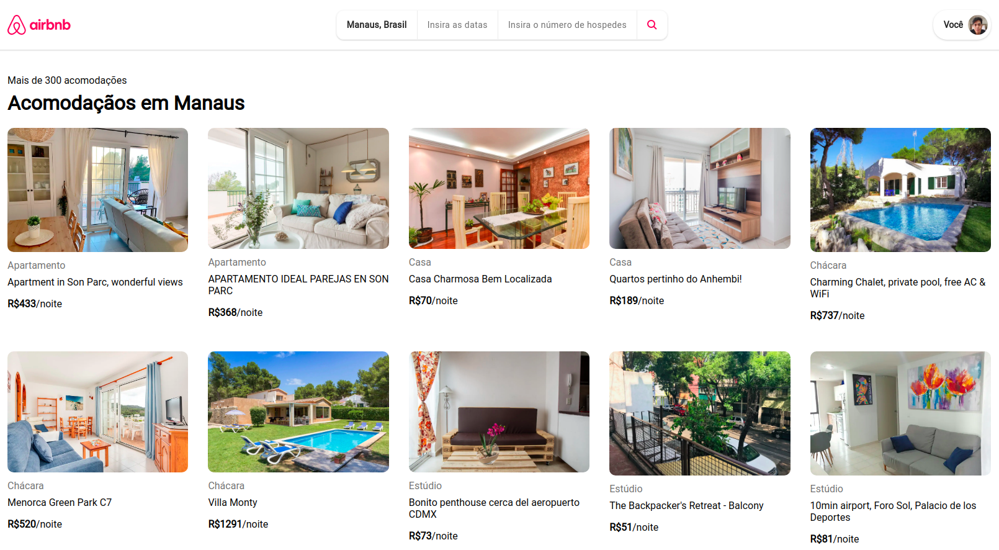

# Airbnb Gama

An Airbnb clone web app created for the GamaAcademy challenge and [Hiring Coders](https://hiringcoders.gama.academy/) program.

This web application was made using:
- HTML
- CSS
- Javascript

## Usage
Follow this steps:
- Clone project to you computer: 
  - `git clone https://github.com/adhamlucas/airbnb-gama-academy.git`
- After that, go to the project folder and open the index.html file.
  
## Access
To acess the site: https://airbnb-clone-adham.netlify.app/index.html

## Api Reference
The Gama Academy provided a simple API with some data of the stays:
- Stay's name
- Link to photo of stays
- Stay's Price
- Stay's type

To access the api: https://api.sheety.co/30b6e400-9023-4a15-8e6c-16aa4e3b1e72   